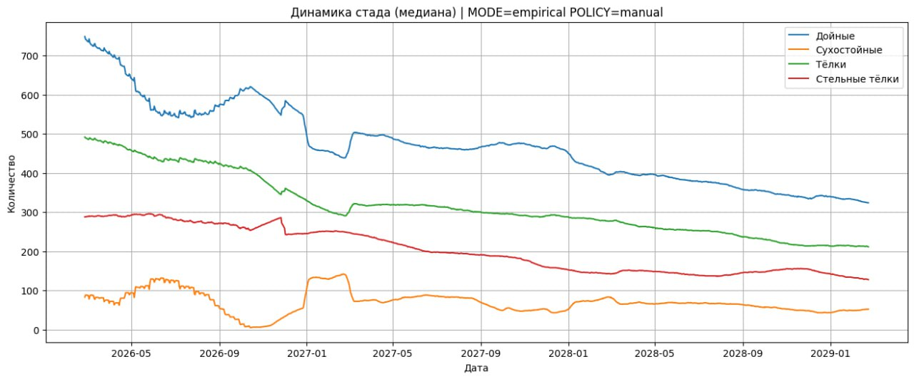
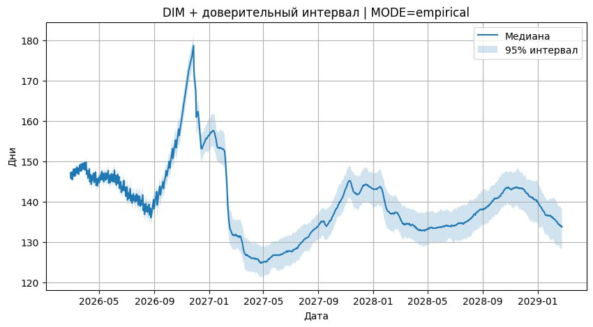
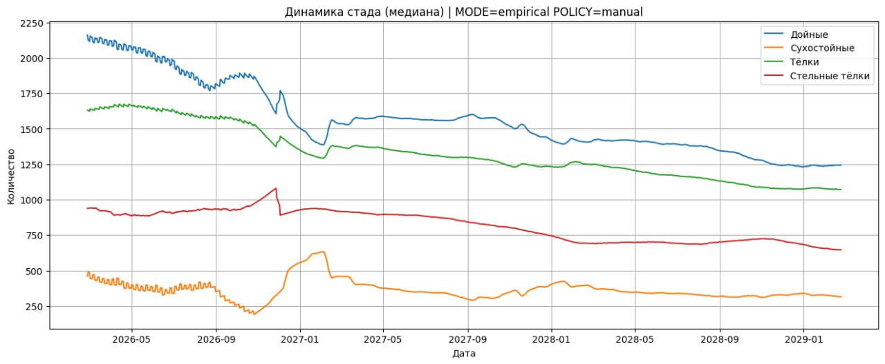

# Прогнозы на 3 года
ForecastData - csv-файлы с данными прогнозов для каждого из предоставленных датасетов соотвественно.

В каждом прогнозе - средние дни доения дойного стада по месяцам, начиная с 01.03.2026
На графике "динамика стада" статистика по стаду - 4 параметра:
- Количество дойных коров
- Количество сухостойных
- Количество телок
- Количество стельных телок

На графике DIN - средние значение средних дней доения и доварительный интервал.

# Графики прогнозов
## Прогноз 1

## Прогноз 2

## Прогноз 3

